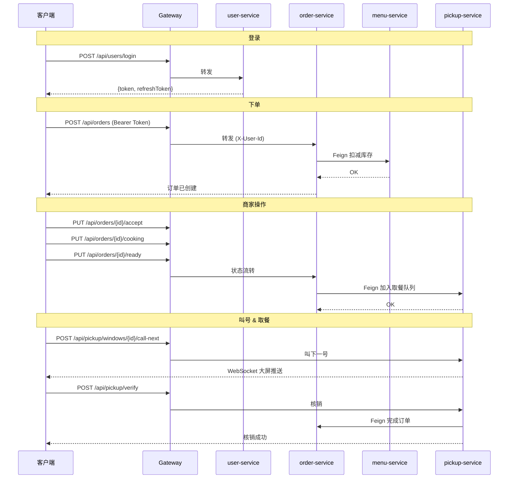

# 智能食堂点餐与取餐微服务系统

面向校园/园区的智能食堂微服务系统，支持**在线点餐**、**商家接单备餐**、**取餐码核销**、**食堂大屏实时显示取餐队列**。本项目为《分布式系统》课程大作业。

## 技术栈

| 类别 | 技术 | 版本 |
|------|------|------|
| 语言 | Java | 17 |
| 框架 | Spring Boot | 3.2.5 |
| 微服务 | Spring Cloud | 2023.0.3 |
| 注册中心 | Spring Cloud Alibaba Nacos | 2023.0.1.0 |
| 网关 | Spring Cloud Gateway | — |
| 远程调用 | Spring Cloud OpenFeign | — |
| 数据库 | MySQL | 8 |
| ORM | MyBatis Plus | 3.5.5 |
| 缓存 | Redis | 7 |
| 认证 | JWT (jjwt) | 0.12.5 |
| 加密 | BCrypt (spring-security-crypto) | — |
| 实时通信 | WebSocket | — |
| 测试 | JUnit 5 + Mockito | — |
| 部署 | Docker + K3S | — |

## 微服务模块说明

| 模块 | 端口 | 职责 |
|------|:---:|------|
| `common` | — | 公共模块：Result、BusinessException、JwtUtil、枚举（7种） |
| `gateway-service` | 8080 | API 网关：路由转发、JWT 校验、Redis 限流 |
| `user-service` | 9001 | 用户服务：注册、登录（JWT 双 Token）、个人信息修改 |
| `menu-service` | 9002 | 菜品服务：CRUD、上下架、原子库存扣减/恢复、每日菜单 |
| `order-service` | 9003 | 订单服务：下单（跨服务扣库存）、状态流转、取消回滚 |
| `pickup-service` | 9004 | 取餐服务：窗口管理、FIFO 排队、叫号 WebSocket 推送、取餐码核销 |

## 系统架构图


### 服务调用时序



## 本地启动

### 1. 启动基础设施（Docker）

```bash
cd deploy
docker compose up -d
```

启动 MySQL 8 (:3307)、Redis 7 (:6379)、Nacos 2.3.2 (:8848)，并自动初始化数据库和演示数据。

确认容器状态：

```bash
docker compose ps
# 应看到 smart-canteen-mysql、smart-canteen-redis、smart-canteen-nacos 均为 Up
```

### 2. 编译项目

```bash
# 在项目根目录执行
mvn clean package -DskipTests
```

### 3. 启动微服务

按依赖顺序，分别在独立终端窗口启动：

```bash
# 终端 1 — 用户服务
mvn -pl user-service spring-boot:run

# 终端 2 — 菜品服务
mvn -pl menu-service spring-boot:run

# 终端 3 — 订单服务
mvn -pl order-service spring-boot:run

# 终端 4 — 取餐服务
mvn -pl pickup-service spring-boot:run

# 终端 5 — 网关（最后启动）
mvn -pl gateway-service spring-boot:run
```

### 4. 验证服务注册

浏览器打开 Nacos 控制台：http://localhost:8848/nacos（账号密码：`nacos`/`nacos`）

在「服务管理 → 服务列表」中，应看到 5 个服务实例。

## 一键启动后端

项目提供了一键启动/停止脚本，位于 `scripts/` 目录，自动完成基础设施启动、项目编译、微服务依次启动。

### 启动

**PowerShell（推荐）：**

```powershell
.\scripts\start-backend.ps1
```

**CMD：** 双击 `scripts\start-backend.bat`

脚本会自动执行以下步骤：

1. 检查 `docker`、`java`、`mvn` 命令是否可用
2. 执行 `docker compose up -d` 启动 MySQL (:3307)、Redis (:6379)、Nacos (:8848)
3. 等待基础设施端口就绪
4. 执行 `mvn clean package -DskipTests` 编译项目
5. 按 `user-service → menu-service → order-service → pickup-service → gateway-service` 顺序启动
6. 每个服务以 `java -Dfile.encoding=UTF-8 -jar` 方式后台运行
7. 启动前检查端口是否已被占用，已占用则跳过
8. 输出服务访问地址和日志目录

### 停止

**PowerShell（推荐）：**

```powershell
# 仅停止微服务
.\scripts\stop-backend.ps1

# 同时关闭 Docker 基础设施（MySQL/Redis/Nacos）
.\scripts\stop-backend.ps1 -WithDocker
```

**CMD：** 双击 `scripts\stop-backend.bat`

脚本按 `gateway-service → pickup-service → order-service → menu-service → user-service` 逆序停止，确保无依赖残留。

### 日志位置

| 内容 | 路径 |
|------|------|
| 服务标准输出 | `logs/<service-name>.log` |
| 服务标准错误 | `logs/<service-name>.err.log` |
| 服务 PID | `logs/pids/<service-name>.pid` |
| 启动脚本日志 | `logs/startup.log` |

### 常见问题

**3306 端口冲突**

如果本机已安装 MySQL 占用 3306 端口，项目 Docker 使用 3307 映射，不受影响。所有服务 application.yml 中 JDBC 连接地址已配置为 `localhost:3307`。

如果 3307 端口也被占用，修改 `deploy/docker-compose.yml` 中 MySQL 的 `ports` 映射为其他端口，并同步修改所有 `application.yml` 中的 JDBC 端口。

**服务端口被占用**

启动脚本会自动检查端口，如果端口已被监听则跳过该服务。如需重新启动，先执行 `stop-backend.ps1`，再确认端口已释放。

**中文乱码**

所有 JDBC 连接已配置 `characterEncoding=utf8&connectionCollation=utf8mb4_unicode_ci`，Java 启动参数已添加 `-Dfile.encoding=UTF-8`，`application.yml` 已配置 `server.servlet.encoding.charset=UTF-8`。

如果仍有乱码，检查 MySQL 容器字符集：

```bash
docker exec smart-canteen-mysql mysql -uroot -proot -e "SHOW VARIABLES LIKE 'character%';"
```

**Nacos 未启动**

等待 Nacos 完全启动需要约 30-60 秒。如果服务启动后报 Nacos 连接错误，等待片刻后重试启动对应服务。可访问 http://localhost:8848/nacos 确认 Nacos 已就绪。

## 主要接口列表

所有接口通过网关 **http://localhost:8080** 统一访问。

### 用户服务 `/api/users`

| 方法 | 路径 | 说明 | 鉴权 |
|------|------|------|:--:|
| POST | `/api/users/register` | 用户注册 | — |
| POST | `/api/users/login` | 手机号+密码登录 | — |
| POST | `/api/users/refresh-token` | 刷新 Token | — |
| GET | `/api/users/me` | 查询当前用户 | JWT |
| PUT | `/api/users/me` | 修改个人信息 | JWT |

### 菜品服务 `/api/menus`

| 方法 | 路径 | 说明 | 鉴权 |
|------|------|------|:--:|
| POST | `/api/menus/dishes` | 新增菜品 | JWT |
| GET | `/api/menus/dishes` | 菜品列表（支持按名称/状态筛选） | JWT |
| GET | `/api/menus/dishes/{id}` | 菜品详情 | JWT |
| PUT | `/api/menus/dishes/{id}` | 修改菜品 | JWT |
| DELETE | `/api/menus/dishes/{id}` | 删除菜品 | JWT |
| PUT | `/api/menus/dishes/{id}/on-sale` | 上架 | JWT |
| PUT | `/api/menus/dishes/{id}/off-sale` | 下架 | JWT |
| POST | `/api/menus/daily` | 创建每日菜单 | JWT |
| GET | `/api/menus/today` | 今日菜单 | JWT |

### 订单服务 `/api/orders`

| 方法 | 路径 | 说明 | 鉴权 |
|------|------|------|:--:|
| POST | `/api/orders` | 创建订单 | JWT |
| GET | `/api/orders/{id}` | 订单详情 | JWT |
| GET | `/api/orders/my` | 我的订单 | JWT |
| GET | `/api/orders/merchant/pending` | 商家待处理订单 | JWT |
| PUT | `/api/orders/{id}/cancel` | 取消订单 | JWT |
| PUT | `/api/orders/{id}/accept` | 接单 | JWT |
| PUT | `/api/orders/{id}/cooking` | 开始制作 | JWT |
| PUT | `/api/orders/{id}/ready` | 备餐完成 | JWT |

### 取餐服务 `/api/pickup`

| 方法 | 路径 | 说明 | 鉴权 |
|------|------|------|:--:|
| POST | `/api/pickup/windows` | 新增窗口 | JWT |
| GET | `/api/pickup/windows` | 窗口列表 | JWT |
| PUT | `/api/pickup/windows/{id}/enable` | 启用窗口 | JWT |
| PUT | `/api/pickup/windows/{id}/disable` | 停用窗口 | JWT |
| GET | `/api/pickup/windows/{id}/queue` | 查询窗口队列 | JWT |
| POST | `/api/pickup/windows/{id}/call-next` | 叫下一号 | JWT |
| POST | `/api/pickup/verify` | 取餐核销 | JWT |

### WebSocket

| 端点 | 说明 |
|------|------|
| `ws://localhost:8080/ws/pickup/screen` | 大屏实时取餐队列推送 |

## 演示账号

数据库初始化后包含 3 个内置用户，密码均为 **`123456`**：

| 角色 | 手机号 | 学工号 | 昵称 |
|------|--------|--------|------|
| 学生 | `13800000001` | `2024001` | 张三 |
| 商家 | `13800000002` | `2024002` | 李老板 |
| 管理员 | `13800000003` | `2024003` | 管理员 |

## 典型演示流程

以下为完整业务流程的 curl 命令演示，所有命令通过网关 `http://localhost:8080` 执行。

### 步骤 1：学生登录

```bash
curl.exe -s -X POST http://localhost:8080/api/users/login \
  -H "Content-Type: application/json" \
  -d '{"phone":"13800000001","password":"123456"}'
```

返回：

```json
{
  "code": 200,
  "message": "登录成功",
  "data": {
    "token": "eyJhbGciOiJIUzI1NiJ9...",
    "refreshToken": "eyJhbGciOiJIUzI1NiJ9...",
    "user": { "id": 1, "phone": "13800000001", "nickname": "张三", "role": "STUDENT" }
  }
}
```

记下返回的 `token` 值，后续操作需要在请求头中携带：

```bash
TOKEN="<粘贴此处的 accessToken>"
```

### 步骤 2：查看菜品列表

```bash
curl -s http://localhost:8080/api/menus/dishes \
  -H "Authorization: Bearer $TOKEN"
```

返回 5 个演示菜品（红烧肉、番茄炒蛋、宫保鸡丁、清炒时蔬、紫菜蛋花汤）及其库存和价格。

### 步骤 3：学生下单

```bash
curl -s -X POST http://localhost:8080/api/orders \
  -H "Authorization: Bearer $TOKEN" \
  -H "Content-Type: application/json" \
  -d '{
    "windowId": 1,
    "items": [
      {"dishId": 1, "dishName": "红烧肉", "price": 25.00, "quantity": 1},
      {"dishId": 2, "dishName": "番茄炒蛋", "price": 12.00, "quantity": 1}
    ]
  }'
```

返回：

```json
{
  "code": 200,
  "message": "下单成功",
  "data": {
    "id": 1,
    "status": "CREATED",
    "totalAmount": 37.00,
    "pickupNo": 156,
    "pickupCode": "482901",
    "items": [ ... ]
  }
}
```

记下订单 ID 和取餐信息。

### 步骤 4：商家登录

```bash
curl.exe -s -X POST http://localhost:8080/api/users/login \
  -H "Content-Type: application/json" \
  -d '{"phone":"13800000002","password":"123456"}'
```

```bash
MERCHANT_TOKEN="<粘贴商家 token>"
ORDER_ID=1
```

### 步骤 5：商家接单

```bash
curl -s -X PUT http://localhost:8080/api/orders/$ORDER_ID/accept \
  -H "Authorization: Bearer $MERCHANT_TOKEN"
```

订单状态变更：CREATED → ACCEPTED

### 步骤 6：商家开始制作

```bash
curl -s -X PUT http://localhost:8080/api/orders/$ORDER_ID/cooking \
  -H "Authorization: Bearer $MERCHANT_TOKEN"
```

订单状态变更：ACCEPTED → COOKING

### 步骤 7：备餐完成，加入取餐队列

```bash
curl -s -X PUT http://localhost:8080/api/orders/$ORDER_ID/ready \
  -H "Authorization: Bearer $MERCHANT_TOKEN"
```

订单状态变更：COOKING → WAIT_PICKUP；后台自动调用 pickup-service 将订单加入队列。

### 步骤 8：查看窗口排队

```bash
curl -s http://localhost:8080/api/pickup/windows/1/queue \
  -H "Authorization: Bearer $MERCHANT_TOKEN"
```

返回当前 1 号窗口的等待队列，按入队时间升序排列。

### 步骤 9：商家叫号

```bash
curl -s -X POST http://localhost:8080/api/pickup/windows/1/call-next \
  -H "Authorization: Bearer $MERCHANT_TOKEN"
```

返回被叫号的记录，同时通过 WebSocket 向大屏推送消息：

```json
{
  "type": "CALL",
  "windowId": 1,
  "windowName": "1号窗口",
  "currentPickupNo": 156,
  "message": "请 156 号到【1号窗口】取餐",
  ...
}
```

### 步骤 10：大屏接收实时推送

使用 WebSocket 客户端连接大屏端点：

```bash
# 使用 websocat 或浏览器 WebSocket 客户端连接
websocat ws://localhost:8080/ws/pickup/screen
```

每次叫号时会收到推送的 JSON 消息。

### 步骤 11：用户取餐核销

```bash
curl -s -X POST http://localhost:8080/api/pickup/verify \
  -H "Authorization: Bearer $TOKEN" \
  -H "Content-Type: application/json" \
  -d '{"pickupNo": 156, "pickupCode": "482901"}'
```

核销成功后，取餐队列状态变为 FINISHED，订单状态变为 COMPLETED。

### 完整流程验证

```bash
# 查看订单最终状态
curl -s http://localhost:8080/api/orders/$ORDER_ID \
  -H "Authorization: Bearer $TOKEN" | grep status
# "status": "COMPLETED"
```

## 运行测试

```bash
# 全量测试（104 个用例）
mvn clean test

# 单模块测试
mvn -pl common -am test           # 21 tests
mvn -pl gateway-service -am test  # 8 tests
mvn -pl user-service -am test     # 19 tests
mvn -pl menu-service -am test     # 18 tests
mvn -pl order-service -am test    # 18 tests
mvn -pl pickup-service -am test   # 20 tests
```

| 模块 | Service 层 | Controller 层 | 合计 |
|------|:---:|:---:|:---:|
| common | 21 | — | **21** |
| gateway-service | 8 | — | **8** |
| user-service | 14 | 5 | **19** |
| menu-service | 12 | 6 | **18** |
| order-service | 12 | 6 | **18** |
| pickup-service | 14 | 6 | **20** |
| **合计** | **81** | **23** | **104** |

## K3S 部署

```bash
# 1. 安装 K3S
curl -sfL https://get.k3s.io | sh -

# 2. 构建 Docker 镜像
mvn clean package -DskipTests
docker build -t smart-canteen/user-service:latest   -f user-service/Dockerfile .
docker build -t smart-canteen/menu-service:latest    -f menu-service/Dockerfile .
docker build -t smart-canteen/order-service:latest   -f order-service/Dockerfile .
docker build -t smart-canteen/pickup-service:latest  -f pickup-service/Dockerfile .
docker build -t smart-canteen/gateway-service:latest -f gateway-service/Dockerfile .

# 3. 导入镜像到 K3S
docker save smart-canteen/* -o images.tar
sudo k3s ctr images import images.tar

# 4. 部署
kubectl apply -f k8s/

# 5. 查看状态
kubectl -n smart-canteen get pods
kubectl -n smart-canteen get svc

# 6. 访问网关
# gateway-service 通过 NodePort 30080 暴露
curl http://<NODE_IP>:30080/api/users/login -H "Content-Type: application/json" -d '{"phone":"13800000001","password":"123456"}'
```

详细说明见 `docs/07-K3S部署方案说明.md`。

## 项目目录结构

```
smart-canteen/
├── pom.xml                              # Maven 父 POM（依赖管理）
├── README.md                            # 本文件
├── CLAUDE.md                            # AI 编码规则
│
├── common/                              # 公共模块
│   ├── pom.xml
│   └── src/main/java/com/smartcanteen/common/
│       ├── enums/                       # 枚举：ErrorCode, OrderStatus,
│       │                                #   PickupQueueStatus, WindowStatus 等
│       ├── exception/BusinessException.java
│       ├── result/Result.java           # 统一返回格式 {code, message, data}
│       ├── jwt/JwtUtil.java             # JWT 生成/解析/校验
│       └── context/UserContextHolder.java
│
├── gateway-service/                     # 网关服务 :8080
│   ├── pom.xml
│   ├── Dockerfile
│   └── src/main/
│       ├── java/.../gateway/
│       │   ├── GatewayApplication.java
│       │   └── config/
│       │       ├── JwtAuthFilter.java   # 全局 JWT 过滤器
│       │       └── RateLimitConfig.java # 限流 Key 解析器
│       └── resources/application.yml
│
├── user-service/                        # 用户服务 :9001
│   ├── pom.xml
│   ├── Dockerfile
│   └── src/main/java/.../user/
│       ├── entity/User.java
│       ├── mapper/UserMapper.java
│       ├── dto/{RegisterDTO,LoginDTO,UpdateUserDTO}.java
│       ├── vo/{UserVO,LoginVO}.java
│       ├── service/{UserService,impl/UserServiceImpl}.java
│       └── controller/UserController.java
│
├── menu-service/                        # 菜品与菜单服务 :9002
│   ├── pom.xml
│   ├── Dockerfile
│   └── src/main/java/.../menu/
│       ├── entity/{Dish,DailyMenu,DailyMenuItem}.java
│       ├── mapper/{DishMapper,DailyMenuMapper,DailyMenuItemMapper}.java
│       ├── dto/{DishDTO,DailyMenuDTO,StockOperateDTO}.java
│       ├── vo/{DishVO,DailyMenuVO}.java
│       ├── service/{DishService,DailyMenuService,impl/...}.java
│       └── controller/MenuController.java
│
├── order-service/                       # 订单服务 :9003
│   ├── pom.xml
│   ├── Dockerfile
│   └── src/main/java/.../order/
│       ├── entity/{Order,OrderItem}.java
│       ├── mapper/{OrderMapper,OrderItemMapper}.java
│       ├── dto/{CreateOrderDTO,OrderItemDTO}.java
│       ├── vo/{OrderVO,OrderItemVO}.java
│       ├── feign/{MenuFeignClient,PickupFeignClient}.java
│       ├── feign/dto/{StockRequest,PickupQueueRequest}.java
│       ├── service/{OrderService,impl/OrderServiceImpl}.java
│       └── controller/OrderController.java
│
├── pickup-service/                      # 取餐与排队服务 :9004
│   ├── pom.xml
│   ├── Dockerfile
│   └── src/main/java/.../pickup/
│       ├── entity/{PickupWindow,PickupQueue}.java
│       ├── mapper/{PickupWindowMapper,PickupQueueMapper}.java
│       ├── dto/{CreateWindowDTO,VerifyRequest,AddToQueueRequest}.java
│       ├── vo/{PickupWindowVO,PickupQueueVO,ScreenMessage}.java
│       ├── feign/OrderFeignClient.java
│       ├── websocket/PickupScreenHandler.java
│       ├── config/{WebSocketConfig,GlobalExceptionHandler}.java
│       ├── service/{PickupService,impl/PickupServiceImpl}.java
│       └── controller/PickupController.java
│
├── deploy/                              # Docker Compose 部署
│   ├── docker-compose.yml               # MySQL + Redis + Nacos
│   └── sql/init.sql                     # 建库建表 + 演示数据
│
├── k8s/                                 # K3S 部署清单
│   ├── namespace.yaml
│   ├── configmap.yaml                   # MySQL 初始化 SQL
│   ├── mysql.yaml
│   ├── redis.yaml
│   ├── nacos.yaml
│   ├── user-service.yaml
│   ├── menu-service.yaml
│   ├── order-service.yaml
│   ├── pickup-service.yaml
│   ├── gateway-service.yaml
│   └── ingress.yaml
│
└── docs/                                # 软件工程文档
    ├── 01-需求规格说明书.md
    ├── 02-概要设计说明书.md
    ├── 03-详细设计说明书.md
    ├── 04-测试用例.md
    ├── 05-测试报告.md
    ├── 06-架构设计文档.md
    └── 07-K3S部署方案说明.md
```
