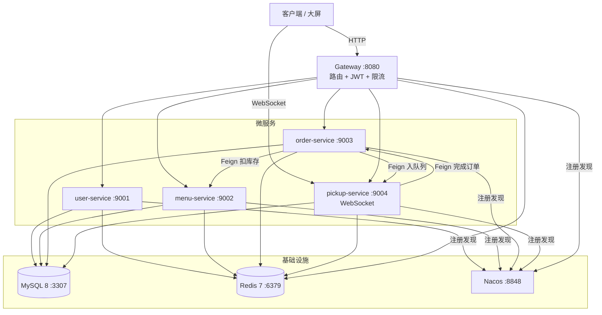
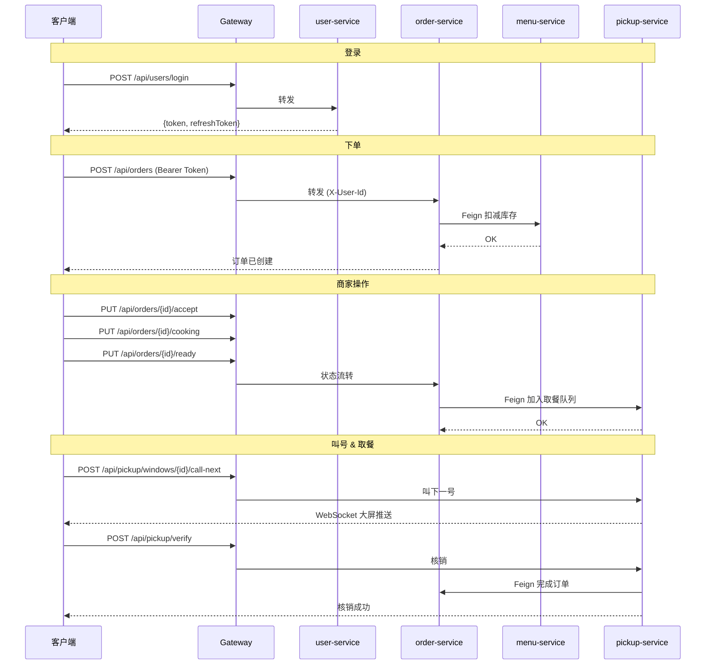

# 智能食堂点餐与取餐微服务系统

面向校园/园区的智能食堂微服务系统，支持**在线点餐**、**商家接单备餐**、**取餐码核销**、**食堂大屏实时显示取餐队列**。本项目为《分布式系统》课程大作业。

## 系统功能

### 学生端

- 注册 / 登录（手机号 + 密码，JWT 双 Token 认证）
- 浏览今日菜单，按名称搜索菜品
- 加入购物车，调整数量，选择取餐窗口，提交订单
- 查看我的订单，查看订单详情（含取餐号、取餐码二维码）
- 取消未处理的订单
- 修改个人信息（昵称、手机号）

### 商家端

- 菜品管理：新增、修改、删除、上架、下架、库存管理
- 每日菜单管理：选择菜品创建当日菜单
- 订单处理：待接单 → 接单 → 制作中 → 备餐完成，完整状态流转
- 取餐管理：窗口选择、叫号、取餐码核销

### 管理员端

- 用户管理
- 全局菜品管理
- 取餐窗口管理
- 系统配置查看

### 大屏端

- WebSocket 实时接收叫号推送
- 全屏深色模式，当前叫号大字显示（160px）
- 等待队列列表（最多 8 条）
- 断线自动重连

## 技术栈

| 类别 | 技术 | 版本 |
|------|------|------|
| 语言 | Java | 17 |
| 框架 | Spring Boot | 3.2.5 |
| 微服务 | Spring Cloud | 2023.0.3 |
| 注册中心 | Spring Cloud Alibaba Nacos | 2023.0.1.0 |
| 网关 | Spring Cloud Gateway | — |
| 远程调用 | Spring Cloud OpenFeign | — |
| 数据库 | MySQL | 8 |
| ORM | MyBatis Plus | 3.5.5 |
| 缓存 | Redis | 7 |
| 认证 | JWT (jjwt) | 0.12.5 |
| 加密 | BCrypt (spring-security-crypto) | — |
| 实时通信 | WebSocket | — |

| 类别 | 技术 | 版本 |
|------|------|------|
| 框架 | Vue 3 | 3.4.x |
| 语言 | TypeScript | 5.5.x |
| 构建 | Vite | 5.3.x |
| 状态管理 | Pinia | 2.1.x |
| 路由 | Vue Router | 4.4.x |
| UI 组件库 | Element Plus | 2.7.x |
| HTTP 客户端 | Axios | 1.7.x |
| CSS 预处理 | Sass | 1.77.x |

| 类别 | 技术 |
|------|------|
| 容器化 | Docker + Docker Compose |
| 编排 | K3S (Kubernetes) |
| 测试 | JUnit 5 + Mockito |
| 构建 | Maven |

## 微服务模块说明

| 模块 | 端口 | 职责 |
|------|:---:|------|
| `common` | — | 公共模块：Result、BusinessException、JwtUtil、枚举 |
| `gateway-service` | 8080 | API 网关：路由转发、JWT 校验、Redis 限流 |
| `user-service` | 9001 | 用户服务：注册、登录（JWT 双 Token）、个人信息修改 |
| `menu-service` | 9002 | 菜品服务：CRUD、上下架、原子库存扣减/恢复、每日菜单 |
| `order-service` | 9003 | 订单服务：下单（跨服务扣库存）、状态流转、取消回滚 |
| `pickup-service` | 9004 | 取餐服务：窗口管理、FIFO 排队、叫号 WebSocket 推送、取餐码核销 |

## 系统架构图



### 服务调用时序



## 目录结构

```
smart-canteen/
├── common/                # 公共模块（Result、JwtUtil、枚举、异常）
├── gateway-service/       # API 网关（路由、JWT、限流）
├── user-service/          # 用户服务
├── menu-service/          # 菜品与菜单服务
├── order-service/         # 订单服务
├── pickup-service/        # 取餐与排队服务
├── frontend/              # Vue 3 前端
│   └── README.md          # 前端说明文档
├── deploy/                # Docker Compose 与初始化 SQL
│   └── README.md          # 部署说明
├── k8s/                   # K3S / Kubernetes 部署 YAML
│   └── README.md          # K3S 部署说明
├── scripts/               # 一键启动/停止脚本
│   └── README.md          # 脚本说明
├── docs/                  # 课程文档（需求、设计、测试等）
│   └── README.md          # 文档目录
├── logs/                  # 运行时日志（自动生成）
└── README.md              # 本文件
```

## 本地启动

### 前提条件

- Docker Desktop 已安装并运行
- Java 17+
- Maven 3.8+
- Node.js 18+（前端开发）

### 1. 启动基础设施（Docker）

```bash
cd deploy
docker compose up -d
```

启动 MySQL 8 (:3307)、Redis 7 (:6379)、Nacos 2.3.2 (:8848)，并自动初始化数据库和演示数据。

确认容器状态：

```bash
docker compose ps
# 应看到 smart-canteen-mysql、smart-canteen-redis、smart-canteen-nacos 均为 Up
```

### 2. 编译项目

```bash
# 在项目根目录执行
mvn clean package -DskipTests
```

### 3. 启动微服务

按依赖顺序，分别在独立终端窗口启动：

```bash
# 终端 1 — 用户服务
mvn -pl user-service spring-boot:run

# 终端 2 — 菜品服务
mvn -pl menu-service spring-boot:run

# 终端 3 — 订单服务
mvn -pl order-service spring-boot:run

# 终端 4 — 取餐服务
mvn -pl pickup-service spring-boot:run

# 终端 5 — 网关（最后启动）
mvn -pl gateway-service spring-boot:run
```

### 4. 验证服务注册

浏览器打开 Nacos 控制台：http://localhost:8848/nacos（账号密码：`nacos`/`nacos`）

在「服务管理 → 服务列表」中，应看到 5 个服务实例。

## 一键启动后端

项目提供了一键启动/停止脚本，位于 `scripts/` 目录，自动完成基础设施启动、项目编译、微服务依次启动。

### 启动

**PowerShell（推荐）：**

```powershell
.\scripts\start-backend.ps1
```

**CMD：** 双击 `scripts\start-backend.bat`

脚本会自动执行以下步骤：

1. 检查 `docker`、`java`、`mvn` 命令是否可用
2. 停止可能残留的旧进程
3. 执行 `docker compose up -d` 启动 MySQL (:3307)、Redis (:6379)、Nacos (:8848)
4. 等待基础设施端口就绪（含 Nacos gRPC :9848）
5. 执行 `mvn clean package -DskipTests` 编译项目
6. 按 `user-service → menu-service → order-service → pickup-service → gateway-service` 顺序启动（使用 `mvn spring-boot:run`）
7. 每个服务启动后等待对应端口就绪，超时则输出错误日志尾部
8. 输出所有服务访问地址

### 停止

```powershell
# 仅停止微服务
.\scripts\stop-backend.ps1

# 同时关闭 Docker 基础设施（MySQL/Redis/Nacos）
.\scripts\stop-backend.ps1 -WithDocker
```

### 日志位置

| 内容 | 路径 |
|------|------|
| 服务标准输出 | `logs/<service-name>.out.log` |
| 服务标准错误 | `logs/<service-name>.err.log` |
| 服务 PID | `logs/pids/<service-name>.pid` |
| 启动脚本日志 | `logs/startup.log` |

### 常见问题

**3306 端口冲突**

如果本机已安装 MySQL 占用 3306 端口，项目 Docker 使用 3307 映射，不受影响。所有服务 application.yml 中 JDBC 连接地址已配置为 `localhost:3307`。

**Nacos gRPC 端口未就绪**

脚本已等待 Nacos :9848（gRPC 端口）。如果服务仍报 `UNAVAILABLE: io exception`，说明 Nacos 容器完全初始化需要更长时间，可手动等待 15 秒后重试。

**服务端口被占用**

启动脚本会自动检查端口，如果端口已被监听则跳过该服务。如需重新启动，先执行 `stop-backend.ps1`。

**中文乱码**

所有 JDBC 连接已配置 `characterEncoding=UTF-8&connectionCollation=utf8mb4_unicode_ci`，Java 启动参数已添加 `-Dfile.encoding=UTF-8`，`application.yml` 已配置 `server.servlet.encoding.charset=UTF-8`。

如果仍有乱码，检查 MySQL 容器字符集：

```bash
docker exec smart-canteen-mysql mysql -uroot -proot -e "SHOW VARIABLES LIKE 'character%';"
```

## 主要接口列表

所有接口通过网关 **http://localhost:8080** 统一访问。

### 用户服务 `/api/users`

| 方法 | 路径 | 说明 | 鉴权 |
|------|------|------|:--:|
| POST | `/api/users/register` | 用户注册 | — |
| POST | `/api/users/login` | 手机号+密码登录 | — |
| POST | `/api/users/refresh-token` | 刷新 Token | — |
| GET | `/api/users/me` | 查询当前用户 | JWT |
| PUT | `/api/users/me` | 修改个人信息 | JWT |

### 菜品服务 `/api/menus`

| 方法 | 路径 | 说明 | 鉴权 |
|------|------|------|:--:|
| POST | `/api/menus/dishes` | 新增菜品 | JWT |
| GET | `/api/menus/dishes` | 菜品列表（支持按名称/状态筛选） | JWT |
| GET | `/api/menus/dishes/{id}` | 菜品详情 | JWT |
| PUT | `/api/menus/dishes/{id}` | 修改菜品 | JWT |
| DELETE | `/api/menus/dishes/{id}` | 删除菜品 | JWT |
| PUT | `/api/menus/dishes/{id}/on-sale` | 上架 | JWT |
| PUT | `/api/menus/dishes/{id}/off-sale` | 下架 | JWT |
| POST | `/api/menus/daily` | 创建每日菜单 | JWT |
| GET | `/api/menus/today` | 今日菜单 | JWT |

### 订单服务 `/api/orders`

| 方法 | 路径 | 说明 | 鉴权 |
|------|------|------|:--:|
| POST | `/api/orders` | 创建订单 | JWT |
| GET | `/api/orders/{id}` | 订单详情 | JWT |
| GET | `/api/orders/my` | 我的订单 | JWT |
| GET | `/api/orders/merchant/pending` | 商家待处理订单 | JWT |
| PUT | `/api/orders/{id}/cancel` | 取消订单 | JWT |
| PUT | `/api/orders/{id}/accept` | 接单 | JWT |
| PUT | `/api/orders/{id}/cooking` | 开始制作 | JWT |
| PUT | `/api/orders/{id}/ready` | 备餐完成 | JWT |

### 取餐服务 `/api/pickup`

| 方法 | 路径 | 说明 | 鉴权 |
|------|------|------|:--:|
| POST | `/api/pickup/windows` | 新增窗口 | JWT |
| GET | `/api/pickup/windows` | 窗口列表 | JWT |
| PUT | `/api/pickup/windows/{id}/enable` | 启用窗口 | JWT |
| PUT | `/api/pickup/windows/{id}/disable` | 停用窗口 | JWT |
| GET | `/api/pickup/windows/{id}/queue` | 查询窗口队列 | JWT |
| POST | `/api/pickup/windows/{id}/call-next` | 叫下一号 | JWT |
| POST | `/api/pickup/verify` | 取餐核销 | JWT |

### WebSocket

| 端点 | 说明 |
|------|------|
| `ws://localhost:8080/ws/pickup/screen` | 大屏实时取餐队列推送 |

## 演示账号

数据库初始化后包含 3 个内置用户，密码均为 **`123456`**：

| 角色 | 手机号 | 学工号 | 昵称 |
|------|--------|--------|------|
| 学生 | `13800000001` | `2024001` | 张三 |
| 商家 | `13800000002` | `2024002` | 李老板 |
| 管理员 | `13800000003` | `2024003` | 管理员 |

## 典型演示流程

以下为完整业务流程的 curl 命令演示，所有命令通过网关 `http://localhost:8080` 执行。

### 步骤 1：学生登录

```bash
curl -s -X POST http://localhost:8080/api/users/login \
  -H "Content-Type: application/json" \
  -d '{"phone":"13800000001","password":"123456"}'
```

返回：

```json
{
  "code": 200,
  "message": "登录成功",
  "data": {
    "token": "eyJhbGciOiJIUzI1NiJ9...",
    "refreshToken": "eyJhbGciOiJIUzI1NiJ9...",
    "user": { "id": 1, "phone": "13800000001", "nickname": "张三", "role": "STUDENT" }
  }
}
```

记下返回的 `token` 值，后续操作需要在请求头中携带：

```bash
TOKEN="<粘贴此处的 token>"
```

### 步骤 2：查看菜品列表

```bash
curl -s http://localhost:8080/api/menus/dishes \
  -H "Authorization: Bearer $TOKEN"
```

返回 5 个演示菜品（红烧肉、番茄炒蛋、宫保鸡丁、清炒时蔬、紫菜蛋花汤）及其库存和价格。

### 步骤 3：学生下单

```bash
curl -s -X POST http://localhost:8080/api/orders \
  -H "Authorization: Bearer $TOKEN" \
  -H "Content-Type: application/json" \
  -d '{
    "windowId": 1,
    "items": [
      {"dishId": 1, "dishName": "红烧肉", "price": 25.00, "quantity": 1},
      {"dishId": 2, "dishName": "番茄炒蛋", "price": 12.00, "quantity": 1}
    ]
  }'
```

返回：

```json
{
  "code": 200,
  "message": "下单成功",
  "data": {
    "id": 1,
    "status": "CREATED",
    "totalAmount": 37.00,
    "pickupNo": 156,
    "pickupCode": "482901",
    "items": [ ... ]
  }
}
```

### 步骤 4：商家登录

```bash
curl -s -X POST http://localhost:8080/api/users/login \
  -H "Content-Type: application/json" \
  -d '{"phone":"13800000002","password":"123456"}'
```

```bash
MERCHANT_TOKEN="<粘贴商家 token>"
ORDER_ID=1
```

### 步骤 5：商家接单

```bash
curl -s -X PUT http://localhost:8080/api/orders/$ORDER_ID/accept \
  -H "Authorization: Bearer $MERCHANT_TOKEN"
```

### 步骤 6：制作完成并入队

```bash
curl -s -X PUT http://localhost:8080/api/orders/$ORDER_ID/cooking \
  -H "Authorization: Bearer $MERCHANT_TOKEN"

curl -s -X PUT http://localhost:8080/api/orders/$ORDER_ID/ready \
  -H "Authorization: Bearer $MERCHANT_TOKEN"
```

### 步骤 7：叫号

```bash
curl -s -X POST http://localhost:8080/api/pickup/windows/1/call-next \
  -H "Authorization: Bearer $MERCHANT_TOKEN"
```

### 步骤 8：取餐核销

```bash
curl -s -X POST http://localhost:8080/api/pickup/verify \
  -H "Authorization: Bearer $MERCHANT_TOKEN" \
  -H "Content-Type: application/json" \
  -d '{"pickupNo": 156, "pickupCode": "482901"}'
```

## 前端

前端为 Vue 3 + TypeScript 单页应用，详见 [frontend/README.md](frontend/README.md)。

快速启动：

```bash
cd frontend
npm install
npm run dev
```

访问 http://localhost:5173，Vite 已配置 `/api` 和 `/ws` 代理到 `http://localhost:8080`。
