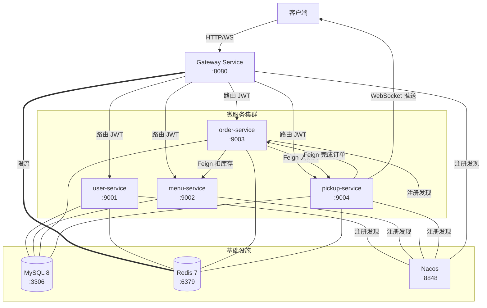
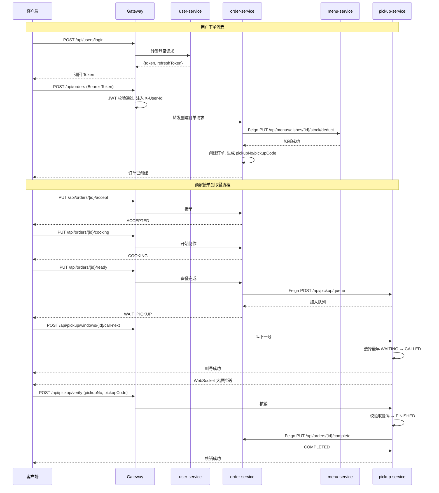
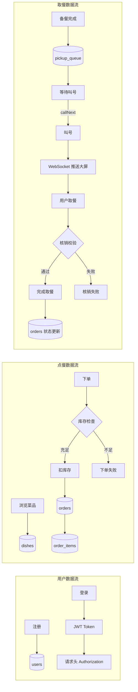
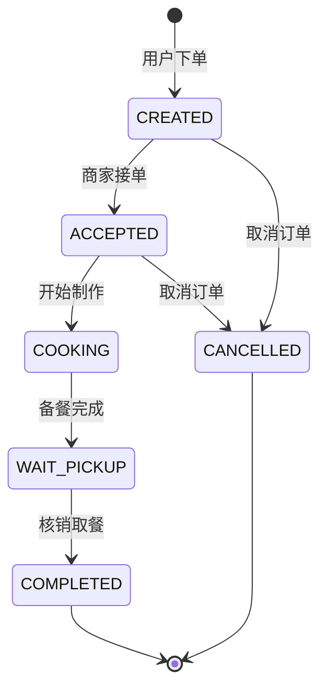

# 架构设计文档

## 1. 微服务架构说明

本系统采用 **Spring Cloud 微服务架构**，通过网络隔离实现服务之间的松耦合。每个微服务独立部署、独立扩展，通过 Nacos 注册中心实现服务发现，通过 OpenFeign 实现声明式服务调用。

### 1.1 架构分层

```
┌─────────────────────────────────────────────┐
│                  客户端层                      │
│          Web 前端 / 移动端 / 大屏              │
└──────────────────┬──────────────────────────┘
                   │  HTTP / WebSocket
┌──────────────────▼──────────────────────────┐
│                  网关层                        │
│   Spring Cloud Gateway (:8080)               │
│   - JWT 认证过滤器                             │
│   - Redis 限流                                │
│   - 路由转发                                   │
└──────────────────┬──────────────────────────┘
                   │
┌──────────────────▼──────────────────────────┐
│                  业务服务层                      │
│  ┌──────────┐ ┌──────────┐ ┌──────────────┐ │
│  │  user    │ │  menu    │ │    order     │ │
│  │ :9001   │ │  :9002   │ │    :9003     │ │
│  └──────────┘ └──────────┘ └──────┬───────┘ │
│                                    │         │
│                         ┌──────────▼───────┐ │
│                         │    pickup        │ │
│                         │    :9004         │ │
│                         │  WebSocket /ws   │ │
│                         └──────────────────┘ │
└──────────────────┬──────────────────────────┘
                   │
┌──────────────────▼──────────────────────────┐
│              基础设施层                         │
│  ┌──────────┐ ┌──────────┐ ┌──────────────┐ │
│  │  MySQL 8 │ │  Redis 7 │ │ Nacos 2.3.2  │ │
│  │  :3306   │ │  :6379   │ │    :8848     │ │
│  └──────────┘ └──────────┘ └──────────────┘ │
└─────────────────────────────────────────────┘
```

## 2. 架构图 (Mermaid)

### 2.1 系统部署架构



### 2.2 服务调用关系



### 2.3 数据流图



### 2.4 订单状态流转



## 3. 关键组件说明

### 3.1 Nacos — 服务注册与发现

- **作用**：所有微服务启动时向 Nacos 注册自身，Gateway 通过 Nacos 发现服务实例并通过负载均衡转发请求。
- **配置**：`spring.cloud.nacos.discovery.server-addr=${NACOS_SERVER_ADDR:localhost:8848}`
- **网关路由**：使用 `lb://service-name` 实现客户端负载均衡。
- **访问**：控制台 http://localhost:8848/nacos，默认账号 nacos/nacos。

### 3.2 Spring Cloud Gateway — API 网关

- **作用**：系统统一入口，提供路由转发、JWT 认证、限流。
- **核心技术**：基于 WebFlux 反应式编程，非阻塞 I/O。
- **过滤器链**：
  1. `JwtAuthFilter` (order=-100)：最早执行，校验 Token 或放行。
  2. `RequestRateLimiter`：基于 Redis 令牌桶算法限流。
- **路由规则**：Path 谓词匹配后通过 `lb://` 转发到对应服务。

### 3.3 OpenFeign — 服务间调用

- **作用**：声明式 HTTP 客户端，简化微服务间 RPC 调用。
- **集成点**：
  - `order-service → menu-service`：扣减/恢复库存。
  - `order-service → pickup-service`：加入取餐队列。
  - `pickup-service → order-service`：核销后完成订单。
- **特点**：集成 LoadBalancer，自动通过 Nacos 解析服务地址。

### 3.4 Redis — 缓存与限流

- **作用**：
  1. 网关限流（令牌桶算法，RedisRateLimiter）。
  2. 服务端缓存（可扩展用途，如 Session 共享）。
- **Key 设计**：
  - 限流 Key：`userKeyResolver` — 优先取 X-User-Id，回退到 IP。
  - 格式：`redis-rate-limiter:{key}.tokens` 和 `redis-rate-limiter:{key}.timestamp`。

### 3.5 JWT — 无状态认证

- **算法**：HMAC-SHA256。
- **密钥**：固定 256-bit Secret Key（配置在 JwtUtil 中）。
- **Token 类型**：
  | 类型 | 有效期 | 用途 |
  |------|--------|------|
  | accessToken | 24 小时 | 业务接口认证 |
  | refreshToken | 7 天 | 续期获取新 accessToken |
- **载荷 (Claims)**：userId, role, type(access/refresh), exp, iat。
- **传递方式**：网关解析 Token 后通过自定义请求头 X-User-Id、X-User-Role 向下传递。

### 3.6 WebSocket — 实时推送

- **端点**：`/ws/pickup/screen`
- **协议**：WebSocket over HTTP/1.1 Upgrade
- **连接管理**：`CopyOnWriteArraySet<WebSocketSession>` 线程安全。
- **消息格式**：JSON 文本帧，结构为 ScreenMessage 对象序列化。
- **触发时机**：商家点击"叫下一号"时，广播到所有连接的大屏客户端。
- **配置**：`WebSocketConfig` 注册 Handler + `setAllowedOrigins("*")`。

## 4. 技术架构对比

| 方案 | 本系统选择 | 备选方案 | 选择理由 |
|------|----------|---------|---------|
| 服务注册 | Nacos | Eureka, Consul | 阿里生态，支持配置管理 |
| 网关 | Spring Cloud Gateway | Zuul, Kong | 响应式非阻塞，Spring 生态集成好 |
| RPC | OpenFeign | Dubbo, gRPC | 声明式 HTTP，与 REST 风格一致 |
| 认证 | JWT | OAuth2, Session | 无状态，适合微服务横向扩展 |
| ORM | MyBatis Plus | JPA, JDBC | 灵活 SQL 控制，Lambda 查询 |
| 部署 | K3S + Docker | 物理机, 虚拟机 | 轻量 Kubernetes，资源占用少 |
